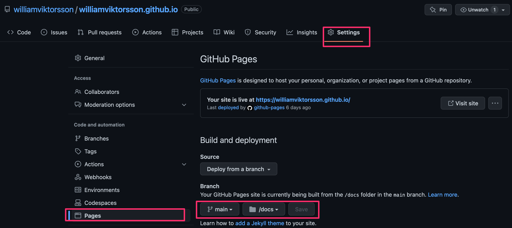

# USERNAME.github.io

Hej! Här är en mall för att hosta en egen hemsida på GitHub i ett projekt som ni kallar USERNAME.github.io där USERNAME är ert användarnamn, typ som att mitt användarnamn är **williamviktorsson**.

Jag har förberett hela detta projekt med det som behövs för att bygga en statisk hemsida med kommandot:

```bash
# create a new project in the current directory
npm run build
```

Detta bygger er hemsida och lägger den i mappen docs/

Ni kan klona detta repo förslagsvis eller zippa och kopiera över det själva.

Eller så kan ni själva fixa med:

```
import adapter from '@sveltejs/adapter-static'; //svelte.config.js
"@sveltejs/adapter-static": "next", //package.json
adapter: adapter({assets:'docs',pages:'docs'}) //svelte.config.js
export const prerender = true; //+layout.js
export const ssr = false; //+layout.js


```

Ni behöver också en fil i mappen static/ som heter .nojekyll

## GitHub Pages

Ni behöver aktivera GitHub Pages för ert repo när ni är klara:



Ni kan [läsa mer här](https://pages.github.com/).

Sedan kommer ni nå er hemsida på Ni kan [https://username.github.io](https://williamviktorsson.github.io/).
